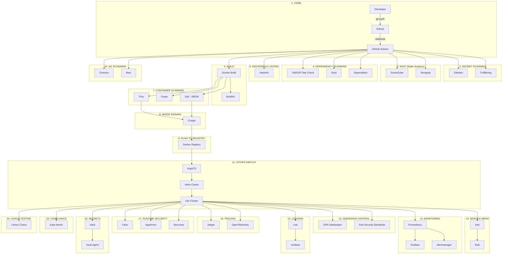
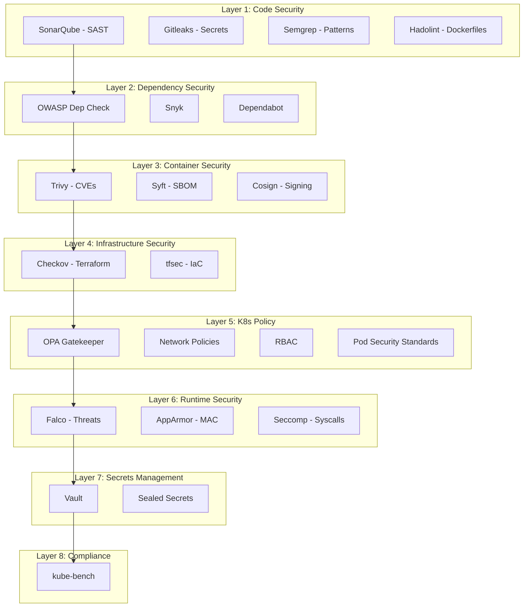
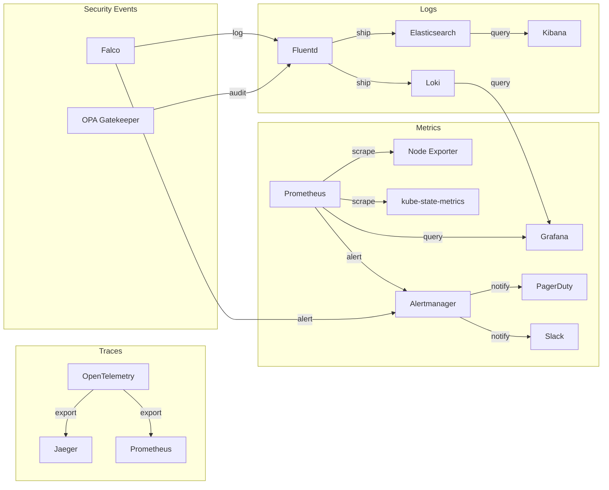
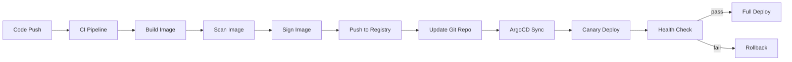

# Architecture Overview

## Complete DevSecOps Pipeline

```mermaid
graph TB
    subgraph "1. CODE"
        A[Developer] -->|git push| B[GitHub]
        B -->|webhook| C[GitHub Actions]
    end
    
    subgraph "2. SECRET SCANNING"
        C --> D[Gitleaks]
        C --> E[TruffleHog]
    end
    
    subgraph "3. SAST (Static Analysis)"
        C --> F[SonarQube]
        C --> G[Semgrep]
    end
    
    subgraph "4. DEPENDENCY SCANNING"
        C --> H[OWASP Dep Check]
        C --> I[Snyk]
        C --> J[Dependabot]
    end
    
    subgraph "5. DOCKERFILE LINTING"
        C --> K[Hadolint]
    end
    
    subgraph "6. BUILD"
        C --> L[Docker Build]
        L --> M[BuildKit]
    end
    
    subgraph "7. CONTAINER SCANNING"
        L --> N[Trivy]
        L --> O[Grype]
        L --> P[Syft - SBOM]
    end
    
    subgraph "8. IMAGE SIGNING"
        N --> Q[Cosign]
        P --> Q
    end
    
    subgraph "9. PUSH TO REGISTRY"
        Q --> R[Docker Registry]
    end
    
    subgraph "10. IaC SCANNING"
        C --> S[Checkov]
        C --> T[tfsec]
    end
    
    subgraph "11. GITOPS DEPLOY"
        R --> U[ArgoCD]
        U --> V[Helm Charts]
        V --> W[k3s Cluster]
    end
    
    subgraph "12. ADMISSION CONTROL"
        W --> X[OPA Gatekeeper]
        W --> Y[Pod Security Standards]
    end
    
    subgraph "13. SERVICE MESH"
        W --> Z[Istio]
        Z --> AA[Kiali]
    end
    
    subgraph "14. MONITORING"
        W --> AB[Prometheus]
        AB --> AC[Grafana]
        AB --> AD[Alertmanager]
    end
    
    subgraph "15. LOGGING"
        W --> AE[Loki]
        AE --> AF[Grafana]
    end
    
    subgraph "16. TRACING"
        W --> AG[Jaeger]
        W --> AH[OpenTelemetry]
    end
    
    subgraph "17. RUNTIME SECURITY"
        W --> AI[Falco]
        W --> AJ[AppArmor]
        W --> AK[Seccomp]
    end
    
    subgraph "18. SECRETS"
        W --> AL[Vault]
        AL --> AM[Vault Agent]
    end
    
    subgraph "19. COMPLIANCE"
        W --> AN[kube-bench]
    end
    
    subgraph "20. CHAOS TESTING"
        W --> AO[Litmus Chaos]
    end
```

## Security Layers

```mermaid
graph TB
    subgraph "Layer 1: Code Security"
        A1[SonarQube - SAST]
        A2[Gitleaks - Secrets]
        A3[Semgrep - Patterns]
        A4[Hadolint - Dockerfiles]
    end
    
    subgraph "Layer 2: Dependency Security"
        B1[OWASP Dep Check]
        B2[Snyk]
        B3[Dependabot]
    end
    
    subgraph "Layer 3: Container Security"
        C1[Trivy - CVEs]
        C2[Syft - SBOM]
        C3[Cosign - Signing]
    end
    
    subgraph "Layer 4: Infrastructure Security"
        D1[Checkov - Terraform]
        D2[tfsec - IaC]
    end
    
    subgraph "Layer 5: K8s Policy"
        E1[OPA Gatekeeper]
        E2[Network Policies]
        E3[RBAC]
        E4[Pod Security Standards]
    end
    
    subgraph "Layer 6: Runtime Security"
        F1[Falco - Threats]
        F2[AppArmor - MAC]
        F3[Seccomp - Syscalls]
    end
    
    subgraph "Layer 7: Secrets Management"
        G1[Vault]
        G2[Sealed Secrets]
    end
    
    subgraph "Layer 8: Compliance"
        H1[kube-bench]
    end
    
    A1 --> B1
    B1 --> C1
    C1 --> D1
    D1 --> E1
    E1 --> F1
    F1 --> G1
    G1 --> H1
```

## Data Flow

```mermaid
graph LR
    subgraph "Metrics"
        A[Prometheus] -->|scrape| B[Node Exporter]
        A -->|scrape| C[kube-state-metrics]
        A -->|query| D[Grafana]
        A -->|alert| E[Alertmanager]
        E -->|notify| F[PagerDuty]
        E -->|notify| G[Slack]
    end
    
    subgraph "Logs"
        H[Fluentd] -->|ship| I[Elasticsearch]
        H -->|ship| J[Loki]
        I -->|query| K[Kibana]
        J -->|query| D
    end
    
    subgraph "Traces"
        L[OpenTelemetry] -->|export| M[Jaeger]
        L -->|export| N[Prometheus]
    end
    
    subgraph "Security Events"
        O[Falco] -->|alert| E
        O -->|log| H
        P[OPA Gatekeeper] -->|audit| H
    end
```

## Deployment Pipeline

```mermaid
graph LR
    A[Code Push] --> B[CI Pipeline]
    B --> C[Build Image]
    C --> D[Scan Image]
    D --> E[Sign Image]
    E --> F[Push to Registry]
    F --> G[Update Git Repo]
    G --> H[ArgoCD Sync]
    H --> I[Canary Deploy]
    I --> J[Health Check]
    J -->|pass| K[Full Deploy]
    J -->|fail| L[Rollback]
```
