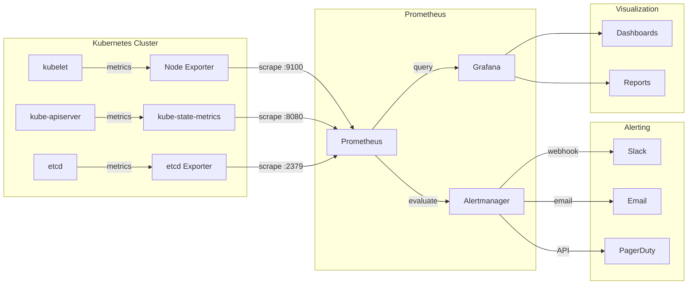
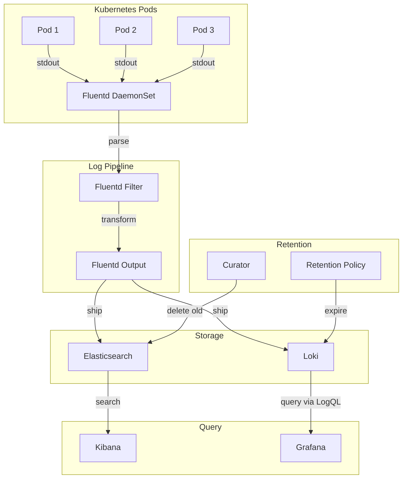
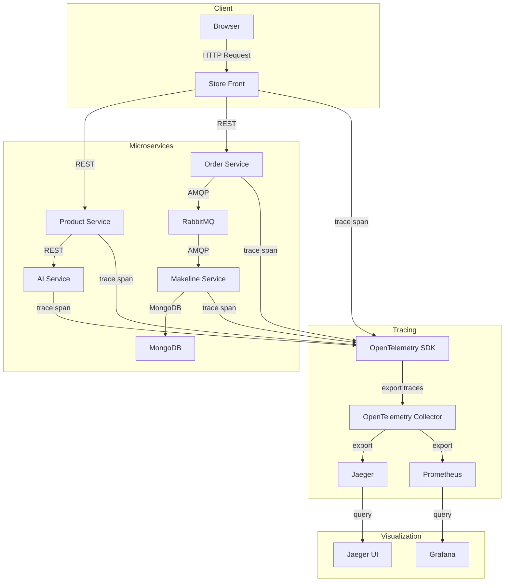
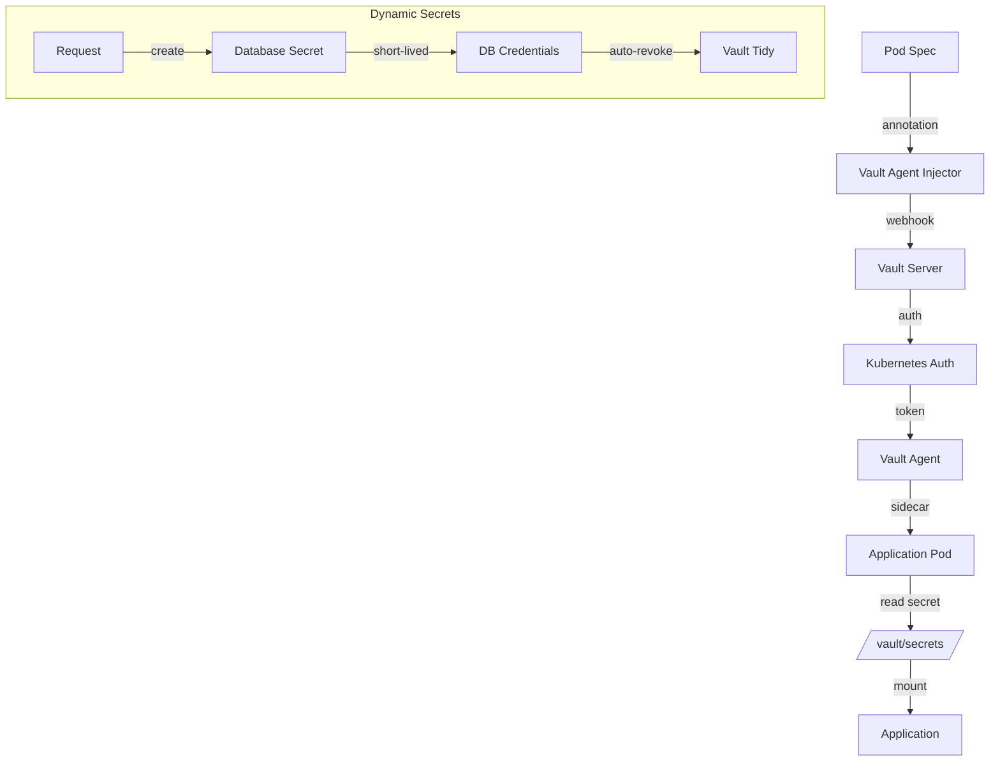
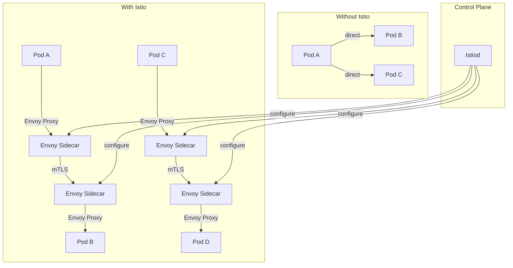

# Data Flow Diagrams

## Metrics Collection Flow

```mermaid
graph LR
    subgraph "Kubernetes Cluster"
        A[kubelet] -->|metrics| B[Node Exporter]
        C[kube-apiserver] -->|metrics| D[kube-state-metrics]
        E[etcd] -->|metrics| F[etcd Exporter]
    end
    
    subgraph "Prometheus"
        B -->|scrape :9100| G[Prometheus]
        D -->|scrape :8080| G
        F -->|scrape :2379| G
        G -->|query| H[Grafana]
        G -->|evaluate| I[Alertmanager]
    end
    
    subgraph "Alerting"
        I -->|webhook| J[Slack]
        I -->|email| K[Email]
        I -->|API| L[PagerDuty]
    end
    
    subgraph "Visualization"
        H --> M[Dashboards]
        H --> N[Reports]
    end
```

## Log Collection Flow

```mermaid
graph TB
    subgraph "Kubernetes Pods"
        A1[Pod 1] -->|stdout| B[Fluentd DaemonSet]
        A2[Pod 2] -->|stdout| B
        A3[Pod 3] -->|stdout| B
    end
    
    subgraph "Log Pipeline"
        B -->|parse| C[Fluentd Filter]
        C -->|transform| D[Fluentd Output]
    end
    
    subgraph "Storage"
        D -->|ship| E[Elasticsearch]
        D -->|ship| F[Loki]
    end
    
    subgraph "Query"
        E -->|search| G[Kibana]
        F -->|query via LogQL| H[Grafana]
    end
    
    subgraph "Retention"
        I[Curator] -->|delete old| E
        J[Retention Policy] -->|expire| F
    end
```

## Distributed Tracing Flow

```mermaid
graph TB
    subgraph "Client"
        A[Browser] -->|HTTP Request| B[Store Front]
    end
    
    subgraph "Microservices"
        B -->|REST| C[Product Service]
        B -->|REST| D[Order Service]
        D -->|AMQP| E[RabbitMQ]
        E -->|AMQP| F[Makeline Service]
        F -->|MongoDB| G[MongoDB]
        C -->|REST| H[AI Service]
    end
    
    subgraph "Tracing"
        B -->|trace span| I[OpenTelemetry SDK]
        C -->|trace span| I
        D -->|trace span| I
        F -->|trace span| I
        H -->|trace span| I
        I -->|export traces| J[OpenTelemetry Collector]
        J -->|export| K[Jaeger]
        J -->|export| L[Prometheus]
    end
    
    subgraph "Visualization"
        K -->|query| M[Jaeger UI]
        L -->|query| N[Grafana]
    end
```

## Secrets Injection Flow

```mermaid
graph TB
    A[Pod Spec] -->|annotation| B[Vault Agent Injector]
    B -->|webhook| C[Vault Server]
    C -->|auth| D[Kubernetes Auth]
    D -->|token| E[Vault Agent]
    E -->|sidecar| F[Application Pod]
    F -->|read secret| G[/vault/secrets/]
    G -->|mount| H[Application]
    
    subgraph "Dynamic Secrets"
        I[Request] -->|create| J[Database Secret]
        J -->|short-lived| K[DB Credentials]
        K -->|auto-revoke| L[Vault Tidy]
    end
```

## Service Mesh Data Flow

```mermaid
graph TB
    subgraph "Without Istio"
        A[Pod A] -->|direct| B[Pod B]
        A -->|direct| C[Pod C]
    end
    
    subgraph "With Istio"
        D[Pod A] -->|Envoy Proxy| E[Envoy Sidecar]
        E -->|mTLS| F[Envoy Sidecar]
        F -->|Envoy Proxy| G[Pod B]
        
        H[Pod C] -->|Envoy Proxy| I[Envoy Sidecar]
        I -->|mTLS| J[Envoy Sidecar]
        J -->|Envoy Proxy| K[Pod D]
    end
    
    subgraph "Control Plane"
        L[Istiod] -->|configure| E
        L -->|configure| F
        L -->|configure| I
        L -->|configure| J
    end
```
