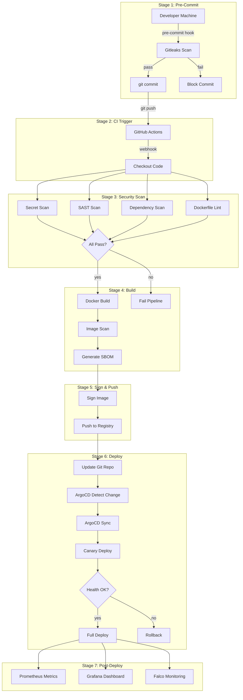
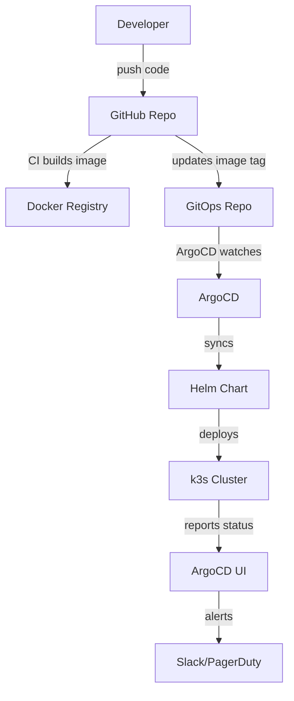
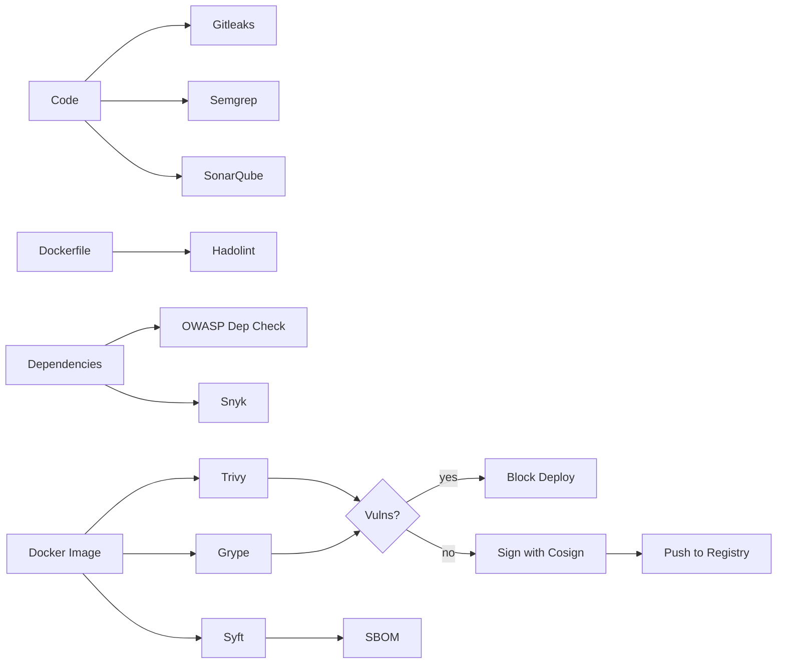
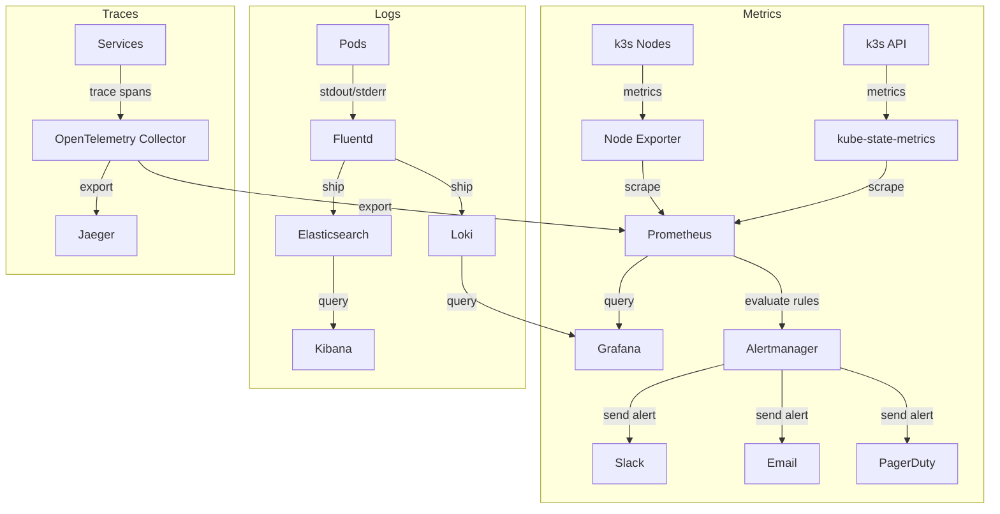

# Pipeline Flow

## CI/CD Pipeline Stages

```mermaid
graph TB
    subgraph "Stage 1: Pre-Commit"
        A[Developer Machine]
        A -->|pre-commit hook| B[Gitleaks Scan]
        B -->|pass| C[git commit]
        B -->|fail| D[Block Commit]
    end
    
    subgraph "Stage 2: CI Trigger"
        C -->|git push| E[GitHub Actions]
        E -->|webhook| F[Checkout Code]
    end
    
    subgraph "Stage 3: Security Scan"
        F --> G[Secret Scan]
        F --> H[SAST Scan]
        F --> I[Dependency Scan]
        F --> J[Dockerfile Lint]
        G --> K{All Pass?}
        H --> K
        I --> K
        J --> K
    end
    
    subgraph "Stage 4: Build"
        K -->|yes| L[Docker Build]
        K -->|no| M[Fail Pipeline]
        L --> N[Image Scan]
        N --> O[Generate SBOM]
    end
    
    subgraph "Stage 5: Sign & Push"
        O --> P[Sign Image]
        P --> Q[Push to Registry]
    end
    
    subgraph "Stage 6: Deploy"
        Q --> R[Update Git Repo]
        R --> S[ArgoCD Detect Change]
        S --> T[ArgoCD Sync]
        T --> U[Canary Deploy]
        U --> V{Health OK?}
        V -->|yes| W[Full Deploy]
        V -->|no| X[Rollback]
    end
    
    subgraph "Stage 7: Post-Deploy"
        W --> Y[Prometheus Metrics]
        W --> Z[Grafana Dashboard]
        W --> AA[Falco Monitoring]
    end
```

## GitOps Flow

```mermaid
graph TB
    A[Developer] -->|push code| B[GitHub Repo]
    B -->|CI builds image| C[Docker Registry]
    B -->|updates image tag| D[GitOps Repo]
    D -->|ArgoCD watches| E[ArgoCD]
    E -->|syncs| F[Helm Chart]
    F -->|deploys| G[k3s Cluster]
    G -->|reports status| H[ArgoCD UI]
    H -->|alerts| I[Slack/PagerDuty]
```

## Security Scanning Flow

```mermaid
graph LR
    A[Code] --> B[Gitleaks]
    A --> C[Semgrep]
    A --> D[SonarQube]
    E[Dockerfile] --> F[Hadolint]
    G[Dependencies] --> H[OWASP Dep Check]
    G --> I[Snyk]
    J[Docker Image] --> K[Trivy]
    J --> L[Grype]
    J --> M[Syft]
    K --> N{Vulns?}
    L --> N
    M --> O[SBOM]
    N -->|yes| P[Block Deploy]
    N -->|no| Q[Sign with Cosign]
    Q --> R[Push to Registry]
```

## Monitoring Flow

```mermaid
graph TB
    subgraph "Metrics"
        A[k3s Nodes] -->|metrics| B[Node Exporter]
        C[k3s API] -->|metrics| D[kube-state-metrics]
        B -->|scrape| E[Prometheus]
        D -->|scrape| E
        E -->|query| F[Grafana]
        E -->|evaluate rules| G[Alertmanager]
        G -->|send alert| H[Slack]
        G -->|send alert| I[Email]
        G -->|send alert| J[PagerDuty]
    end
    
    subgraph "Logs"
        K[Pods] -->|stdout/stderr| L[Fluentd]
        L -->|ship| M[Elasticsearch]
        L -->|ship| N[Loki]
        M -->|query| O[Kibana]
        N -->|query| F
    end
    
    subgraph "Traces"
        P[Services] -->|trace spans| Q[OpenTelemetry Collector]
        Q -->|export| R[Jaeger]
        Q -->|export| E
    end
```
