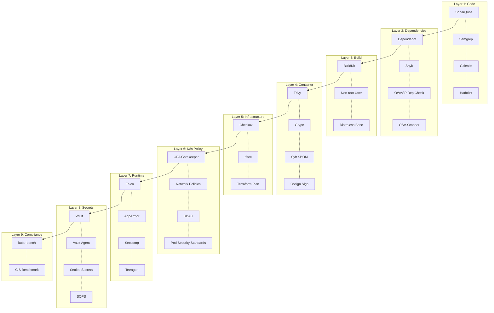
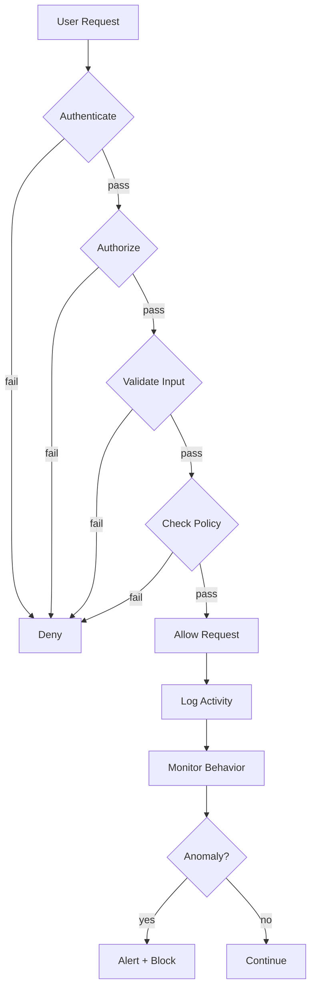

# Security Layers Diagram

## Defense in Depth

```mermaid
graph TB
    subgraph "Layer 1: Code"
        direction LR
        A1[SonarQube] -.- A2[Semgrep]
        A2 -.- A3[Gitleaks]
        A3 -.- A4[Hadolint]
    end
    
    subgraph "Layer 2: Dependencies"
        direction LR
        B1[Dependabot] -.- B2[Snyk]
        B2 -.- B3[OWASP Dep Check]
        B3 -.- B4[OSV-Scanner]
    end
    
    subgraph "Layer 3: Build"
        direction LR
        C1[BuildKit] -.- C2[Non-root User]
        C2 -.- C3[Distroless Base]
    end
    
    subgraph "Layer 4: Container"
        direction LR
        D1[Trivy] -.- D2[Grype]
        D2 -.- D3[Syft SBOM]
        D3 -.- D4[Cosign Sign]
    end
    
    subgraph "Layer 5: Infrastructure"
        direction LR
        E1[Checkov] -.- E2[tfsec]
        E2 -.- E3[Terraform Plan]
    end
    
    subgraph "Layer 6: K8s Policy"
        direction LR
        F1[OPA Gatekeeper] -.- F2[Network Policies]
        F2 -.- F3[RBAC]
        F3 -.- F4[Pod Security Standards]
    end
    
    subgraph "Layer 7: Runtime"
        direction LR
        G1[Falco] -.- G2[AppArmor]
        G2 -.- G3[Seccomp]
        G3 -.- G4[Tetragon]
    end
    
    subgraph "Layer 8: Secrets"
        direction LR
        H1[Vault] -.- H2[Vault Agent]
        H2 -.- H3[Sealed Secrets]
        H3 -.- H4[SOPS]
    end
    
    subgraph "Layer 9: Compliance"
        direction LR
        I1[kube-bench] -.- I2[CIS Benchmark]
    end
    
    A1 --> B1
    B1 --> C1
    C1 --> D1
    D1 --> E1
    E1 --> F1
    F1 --> G1
    G1 --> H1
    H1 --> I1
```

## Security Tools by Attack Surface

```mermaid
graph TB
    subgraph "Source Code"
        A[Git Repository]
        A --> B[Gitleaks - Hardcoded Secrets]
        A --> C[SonarQube - Code Vulnerabilities]
        A --> D[Semgrep - Security Patterns]
    end
    
    subgraph "Dependencies"
        E[Package Managers]
        E --> F[OWASP Dep Check - Known CVEs]
        E --> G[Snyk - Vulnerability Database]
        E --> H[Dependabot - Auto Updates]
    end
    
    subgraph "Build"
        I[Docker Build]
        I --> J[Hadolint - Dockerfile Issues]
        I --> K[BuildKit - Secret Mounting]
        I --> L[Non-root User]
    end
    
    subgraph "Container Image"
        M[Registry]
        M --> N[Trivy - Image CVEs]
        M --> O[Syft - SBOM Generation]
        M --> P[Cosign - Image Signing]
    end
    
    subgraph "Kubernetes"
        Q[Cluster]
        Q --> R[OPA Gatekeeper - Policy]
        Q --> S[Network Policies - Microseg]
        Q --> T[RBAC - Access Control]
        Q --> U[Pod Security - Restrictions]
    end
    
    subgraph "Runtime"
        V[Running Pods]
        V --> W[Falco - Syscall Monitoring]
        V --> X[AppArmor - MAC]
        V --> Y[Seccomp - Syscall Filter]
    end
    
    subgraph "Infrastructure"
        Z[Cloud/On-Prem]
        Z --> AA[Checkov - IaC Scan]
        Z --> AB[Terraform Plan Review]
    end
```

## Zero Trust Architecture

```mermaid
graph TB
    A[User Request] --> B{Authenticate}
    B -->|fail| C[Deny]
    B -->|pass| D{Authorize}
    D -->|fail| C
    D -->|pass| E{Validate Input}
    E -->|fail| C
    E -->|pass| F{Check Policy}
    F -->|fail| C
    F -->|pass| G[Allow Request]
    G --> H[Log Activity]
    H --> I[Monitor Behavior]
    I --> J{Anomaly?}
    J -->|yes| K[Alert + Block]
    J -->|no| L[Continue]
```
